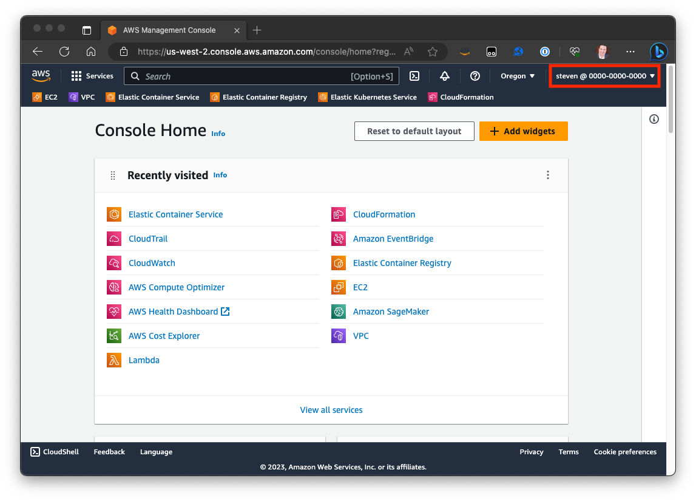
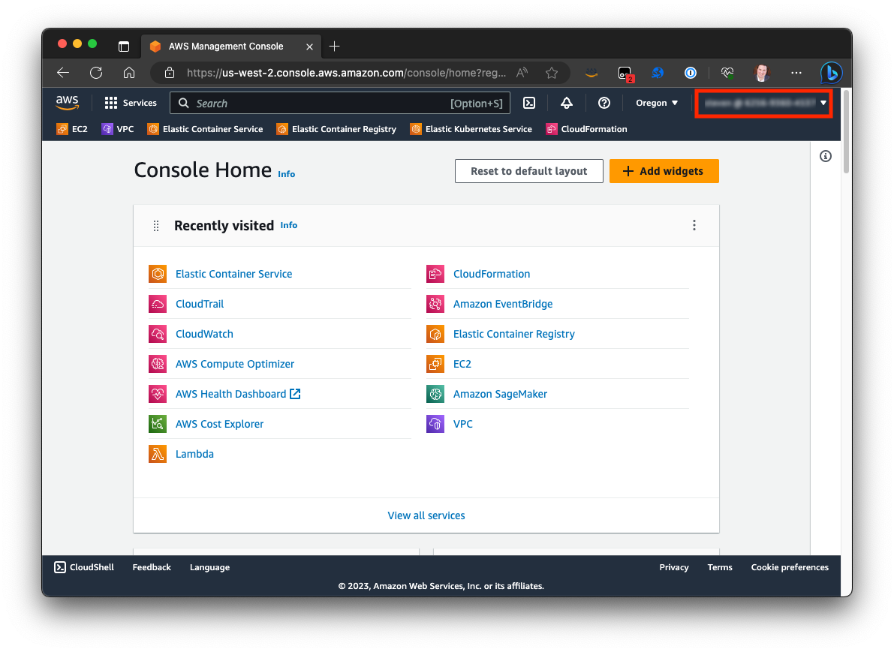
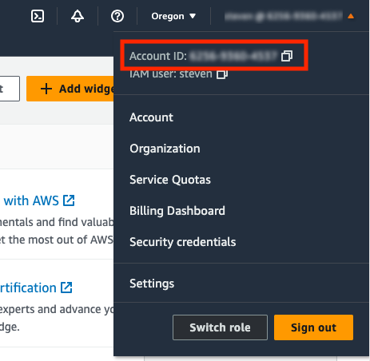

# aws-console-hide-account

This simple [Tampermonkey](https://www.tampermonkey.net/) script hides the logged in user's AWS Account ID when using the [AWS Console](https://aws.amazon.com/console/).

### Before

### After

## Installation

1. [Install](https://www.tampermonkey.net/faq.php#Q100) and enable the Tampermonkey browser extension for your browser

1. [Open](https://github.com/stevenfollis/aws-console-hide-account/raw/main/AWSConsoleAccountIdObfuscator.user.js) this repository's JavaScript file

1. The Tampermonkey extension should detect that the browser is viewing a Tampermonkey script and provide the ability to easily click "Install."

1. Reload the [AWS Console](https://console.aws.amazon.com/) and Account IDs should now be obscured.

## Impetus

When sharing screen during presentations, the AWS Account ID is featured prominently in the browser window. While not likely a security issue, when presenting to public audiences it does not hurt to obscure the Account ID to avoid any potential nefarious uses of that number.

## Technical Approach

The AWS Console is a complicated JavaScript application. Rather than directly manipulating the text values, it was simpler to utilize CSS to blur the number values. This script builds and injects a tiny snippet of CSS to make the text not readable by humans.

## Bonus

This script also blurs the Account ID when expanding the top nav's menu, while leaving the copy icon's functionality intact.

